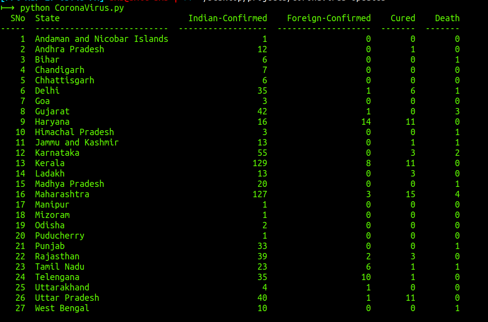
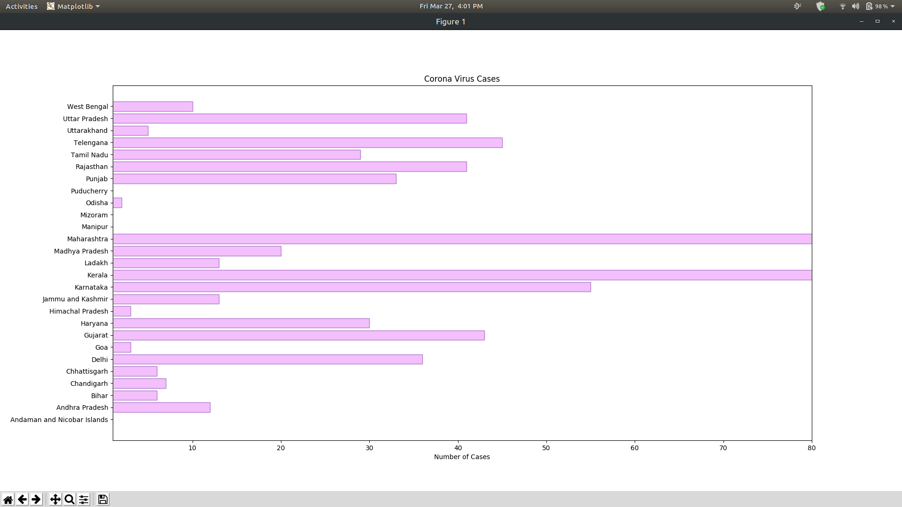

# CoronaVirus-Updates

A script for getting real time data about the coronavirus cases in INDIA.
This Python script fetches the live data from Ministry of Health Affairs Official Website. Then data is represented in the horizontal bar graph.


### Prerequisites
Fork the project or clone this repository to run the required script.
Here, the Ministry of Health Affairs Official Website is scraped for Indian Data that is being updated over the course of time.
Libraries used are:

```
BeautifulSoup
Tabulate
Matplotlib
Numpy
Tkinter
```

### Installing

Just open the terminal and run these commands before running the script.

```
$ sudo apt-install python-tk
$ pip install bs4
$ pip install tabulate
$ pip install matplotlib
$ pip install numpy 
```

	
## Running the script

```
$ python CoronaVirus.py
```


## Screenshots of Output

Tabular Output Also printed on terminal:





Graph Plotted:


